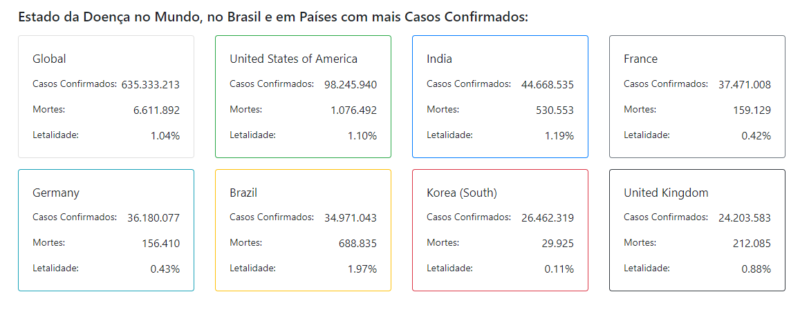

# PAINEL COVID-19

<!---Esses são exemplos. Veja https://shields.io para outras pessoas ou para personalizar este conjunto de escudos. Você pode querer incluir dependências, status do projeto e informações de licença aqui--->

> Linha adicional de texto informativo sobre o que o projeto faz. Sua introdução deve ter cerca de 2 ou 3 linhas. Não exagere, as pessoas não vão ler.

### Ajustes e melhorias

O projeto ainda está em desenvolvimento e as próximas atualizações serão voltadas nas seguintes tarefas:

- [x] AJUSTES NOS GRÁFICOS - MELHOR VIZUALIZAÇÃO
- [x] ADICIONAR UMA TABELA GERAL DE CASOS E MORTES
- [x] DADOS DE MORTALIDADE DOS PAÍSES, PARA VER IMPACTO DA COVID EM NÚMEROS DE MORTES

## 📝 Licença

Esse projeto está sob licença. Veja o arquivo [LICENÇA](LICENSE.md) para mais detalhes.

[⬆ Voltar ao topo](#nome-do-projeto) 
